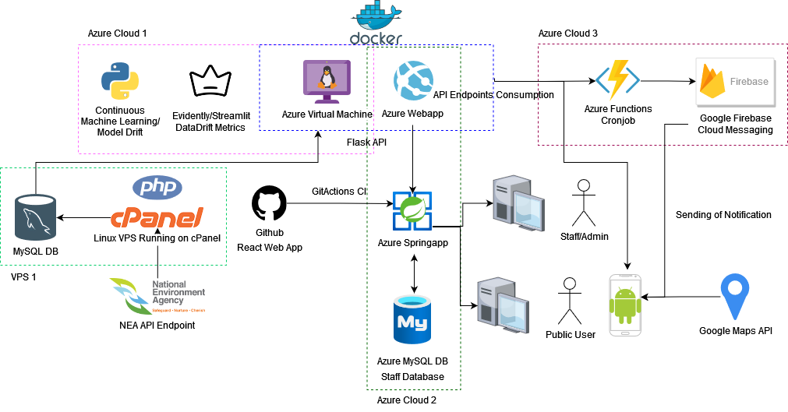

# Table of Contents
1. [Overview](#overview)
2. [PHP Script Setup](#php-script-setup)
3. [Virtual Machine Setup](#virtual-machine-setup)
   - [Server Setup](#server-setup)
   - [User Management](#user-management)
   - [Connection and Evaluation](#connection-and-evaluation)
   - [Cronjob Management](#cronjob-management)
4. [File Descriptions](#file-descriptions)
5. [API Endpoints](#api-endpoints)

## Overview
This document describes the setup and usage of a system that collects temperature and humidity data from Singapore NEA’s API Endpoint, stores it in a MySQL database, and hosts a virtual machine for data processing and modeling using an LSTM neural network. The architectural diagram for the project is shown below:


The files contained here are for VPS 1 and Azure Cloud 1. VPS1 is a VPS hosted on cpanel.

## PHP Script Setup
- Script: `temperaturedatawithexception.php`
- Database: MySQL to store temperature and humidity data.
- Cron Setup: Cron the PHP script to run every minute, retrieving data from NEA API endpoints.

## Virtual Machine Setup
### Server Setup
**Step 1:** Download Anaconda
Connect to your server and download the Anaconda installer.
```
wget https://repo.anaconda.com/archive/Anaconda3-2021.05-Linux-x86_64.sh
```
**Step 2-8:** Installation and Configuration
Follow the steps to install Anaconda, configure the firewall, create and activate the Conda environment, and install dependencies.

**Step 2:** Install Anaconda

Run the installer script:
```
bash Anaconda3-2021.05-Linux-x86_64.sh
```
Follow the prompts in the installer to specify the installation location and whether to add Anaconda to your PATH.

**Step 3:** Configure Firewall

Allow incoming traffic on ports 5000 (for your application), 22 (SSH), and 80 (HTTP):
```
sudo ufw allow 5000
sudo ufw allow 22
sudo ufw allow 80
```
**Step 4:** Enable Firewall

Enable the firewall to start blocking unwanted traffic:

```
sudo ufw enable

```
**Step 5:** Create and Activate Conda Environment

Create a new Conda environment named api_env with Python 3.10:

```
conda create --name api_env python=3.10
```
**Step 6:** Activate Conda Environment

Activate the newly created environment:

```
conda activate api_env
```

**Step 7:** Install Dependencies

Assuming you have a requirements.txt file with your project's dependencies, use pip to install them:

```
pip install -r requirements.txt
```

**Step 8:** Server Setup Complete

Your server setup is now complete, and you've installed Anaconda, configured the firewall, created a Conda environment, activated it, and installed your project's dependencies. You can now proceed to run your application using the environment you've created.

### User Management
Create and test new users.
```
sudo adduser newusername
sudo usermod -aG sudo newusername
su - newusername
```

### Connection and Evaluation
Connect to the virtual machine and evaluate files as needed. Important Files: `script.py`, `app.py`, `model.py`, `incremental.py`, `streamlit.py`.
```
ssh -i developer.pem developer@[IP_ADDRESS]
```
### Cronjob Management
Edit, list, and manage Cronjobs.
```
sudo crontab -e
sudo crontab -l
```

## File Descriptions
- `app.py`: Endpoints for the trained model.
- `incremental.py`: Incremental learning and validation.
- `streamlit.py`: Evaluation of data drift.

## API Endpoints
List of available endpoints with examples:
- `/predict?hour=2&station_id=S111`
- `/current?station_id=S111`
- `/all_current`
- `/mse?station_id=S111`
- `/day_forecast?station_id=S111&day=1`

